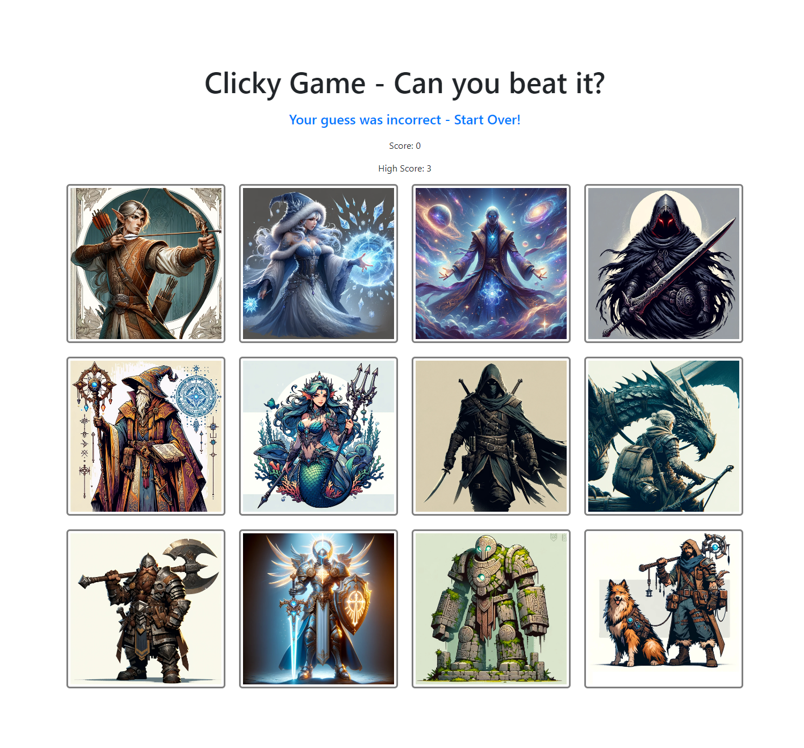

# Clicky Game

## Overview

The Clicky Game is a React application designed to test and enhance memory skills. Users are presented with a grid of images, and their objective is to click on each image only once. The game keeps track of the user's score and shuffles the images after every click. This project focuses on building a memory game using React components, managing component state, and handling user events.

## Table of Contents

- [Overview](#overview)
- [Instructions](#instructions)
- [Demo and Screenshots](#demo-and-screenshots)
- [Features](#features)
- [Acknowledgements](#acknowledgements)
- [Technologies Used](#technologies-used)
- [License](#license)

## Instructions

To set up and run the Clicky Game, follow these steps:

1. Clone the repository to your local machine using `git clone https://github.com/MrKatrish/clicky-game.git`.
2. Navigate to the cloned directory and set up a new React application using Vite.
3. Customize the images rendered by the application, replacing them with images of your choice.
4. Implement the logic to track the user's score, ensuring it increments when clicking on an image for the first time and resets to 0 if the same image is clicked more than once.
5. Shuffle the images after each click to provide a new challenge to the user.
6. Deploy the application to Netlify or your preferred hosting service.

## Demo and Screenshots

## Features

- Interactive memory game with React
- Score tracking system
- Image shuffling after each click
- User-friendly interface

## Acknowledgements

This project was made possible thanks to the following:

- React community for providing valuable resources and support.
- Netlify for hosting the application.
- All contributors who tested the application and provided feedback.

## Technologies Used

- React
- Vite
- HTML
- CSS

## License

This project is licensed under the [MIT License](LICENSE).

© 2024 Your Name. All Rights Reserved.
